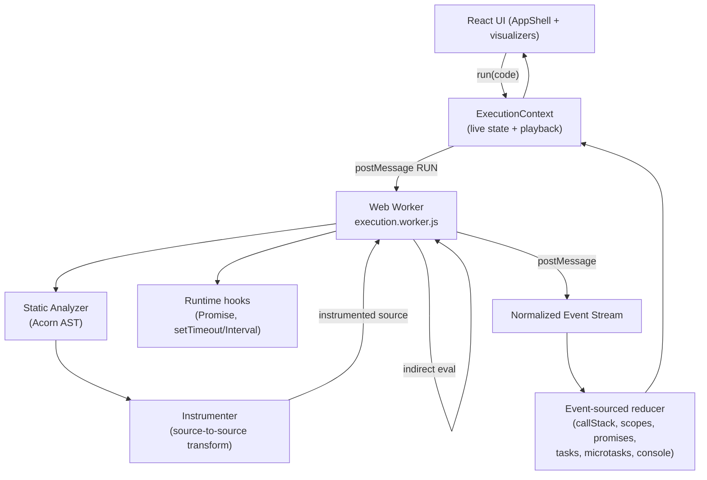
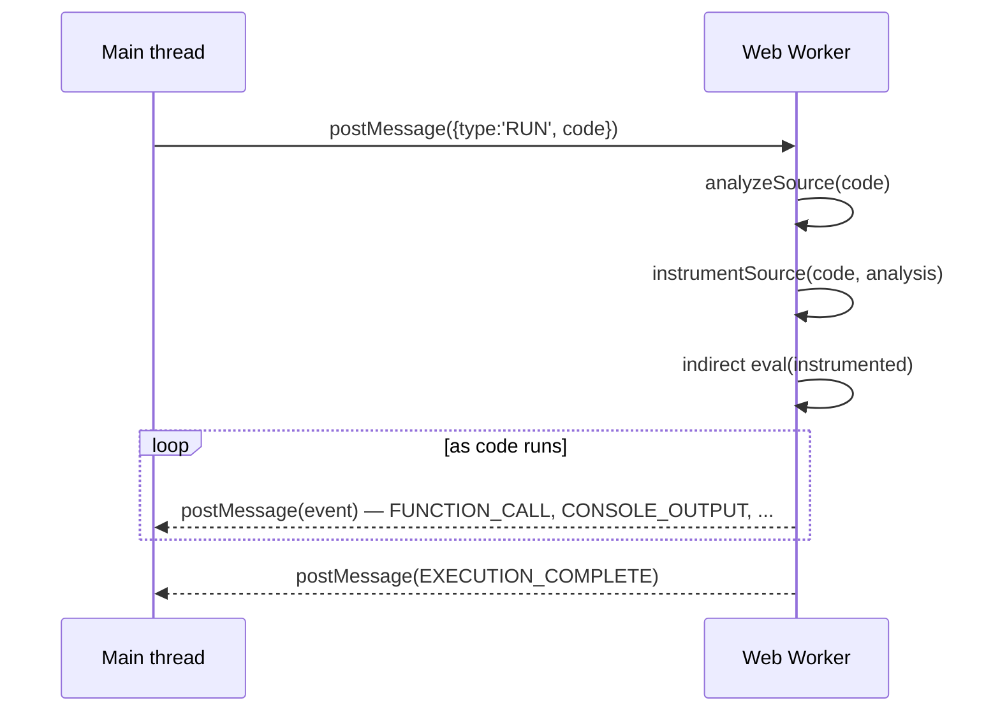
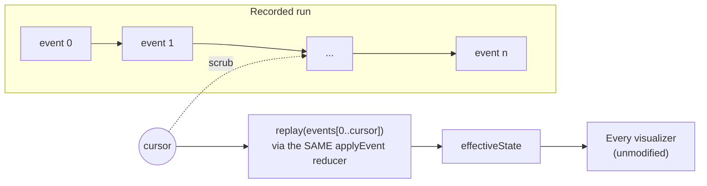
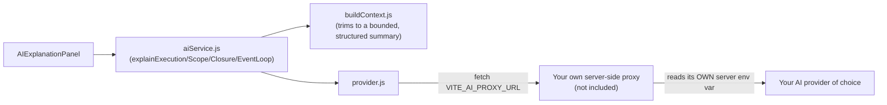

# AI Code Observatory

A browser-based JavaScript execution visualization and analysis environment — write JavaScript, then watch how it actually runs: the call stack, lexical scopes, closures, promises, the event loop, memory references, and a scrubbable execution timeline, all derived from **real instrumented execution**, not a scripted animation.

This is not a code editor with a run button. It's closer to "Chrome DevTools meets a JavaScript runtime laboratory" — every visualization is built from genuine events emitted while your code actually executes in a Web Worker.

## Table of contents

- [Quick start](#quick-start)
- [What it does](#what-it-does)
- [Architecture](#architecture)
- [React architecture](#react-architecture)
- [The execution engine](#the-execution-engine)
  - [Web Worker architecture](#web-worker-architecture)
  - [AST analysis](#ast-analysis)
  - [Instrumentation](#instrumentation)
  - [Event model](#event-model)
- [Visualizer models](#visualizer-models)
  - [Call stack](#call-stack-model)
  - [Scope](#scope-model)
  - [Closures](#closure-model)
  - [Event loop](#event-loop-model)
  - [Promises](#promise-model)
  - [Memory references](#memory-reference-model)
  - [Timeline & playback](#timeline--playback-model)
  - [Performance](#performance-model)
- [AI explanation architecture](#ai-explanation-architecture)
- [Security](#security)
- [Browser API limitations](#browser-api-limitations)
- [Installation & development](#installation--development)
- [Production considerations](#production-considerations)
- [Lessons learned](#lessons-learned)
- [Future roadmap](#future-roadmap)

## Quick start

```bash
npm install
npm run dev
```

Open the printed localhost URL, pick an example from the sidebar (or write your own code), and press **Run** (or `Ctrl/Cmd+Enter`).

## What it does

| Panel | What it shows | Source of truth |
|---|---|---|
| Call Stack | Live push/pop of function frames, including recursion | Real `FUNCTION_CALL`/`FUNCTION_RETURN` events |
| Scopes | The full static scope tree, with live "active" badges and current values | Static analysis + runtime variable events |
| Closures | Which functions capture which outer variables, and how often they're actually accessed | Static analysis + runtime `CLOSURE_ACCESS` events |
| Event Loop | Call stack / Web APIs / microtask queue counts, an inferred phase, and an ordered "why this order" log | Real hooked `Promise`/timer APIs |
| Promises | State-transition chains (`Pending → Fulfilled/Rejected`), linked to their microtask reactions | Real hooked `Promise` subclass |
| Memory | Which variables alias the *same* object vs. merely equal ones | Object-identity tracking across the worker boundary |
| Web APIs | Separate Web-APIs / Task-Queue / Microtask-Queue listings | Same timer/promise event stream |
| Timeline | A flame-graph-style scrub/replay of the entire run, keeping every panel in sync at any point | Event-sourced replay of the same event log |
| Performance | Real `performance.now()` timings and literal event counts | Measured, not estimated |
| AI Explanation | Optional, provider-independent — not configured by default | See [AI architecture](#ai-explanation-architecture) |

## Architecture



The main thread never executes user code. It sends source text to a Web Worker; the worker statically analyzes it, source-transforms it to emit trace calls, and runs the transformed code via indirect `eval`. Every call/scope/variable/closure event, plus every real `Promise`/timer event (hooked, not simulated), streams back over `postMessage` as one normalized event type. A single pure reducer folds that stream into the derived state every visualizer reads — which is also what makes timeline replay possible for free (see [Timeline & playback](#timeline--playback-model)).

## React architecture

- **Context**: `ThemeContext` (dark/light/system) and `ExecutionContext` (the one and only source of execution state — see below) are the only two genuinely global concerns; everything else is local component state or props.
- **`useReducer`** drives the execution state machine (`hooks/useCodeExecution.js`) — a pure `applyEvent(state, event)` function that's reused, unmodified, by the playback replay engine.
- **Custom hooks** (`src/hooks/`):
  - `useWorker` — generic Web Worker lifecycle: create/terminate, generation-tagged so stale messages from a replaced worker are discarded (a real race in Run → Stop → Run).
  - `useCodeExecution` — the reducer + worker wiring; owns `sourceCode`, `events`, and every derived slice.
  - `usePlayback` — timeline scrubbing on top of a finished run's event log (snapshot-cached replay).
  - `useSourceAnalysis` — memoized static analysis, re-run on the main thread for visualizer structure.
  - `useVariableValues` / `useMemoryModel` — incrementally-derived (not O(n²) — see [Lessons learned](#lessons-learned)) views over the event log.
  - `useKeyboardShortcuts` — one global listener, careful to back off wherever a key already has a job (typing, native buttons, our own Tabs component).
- **Components** are organized by concern: `layout/` (shell, header, sidebar), `editor/` (CodeMirror + toolbar + examples), `execution/` (controls, status, timeline, performance), `visualizers/` (the seven analysis panels), `console/`, `ai/`, `common/` (Button, Panel, Tabs, EmptyState, Loader, CommandPalette).
- Every visualizer reads state through `useExecution()` and nothing else — which is *why* Timeline scrubbing can transparently override what every panel shows (see below) without a single visualizer knowing playback exists.

## The execution engine

### Web Worker architecture



A **new worker is created for every run** (Run always terminates the previous one first). This means Stop is unconditional: `worker.terminate()` reclaims a genuinely stuck `while(true){}` regardless of what the worker was doing, because termination is an OS-level operation, not a message the stuck code has to cooperate with.

### AST analysis

`engine/analyzer/analyzeSource.js` parses with [Acorn](https://github.com/acornjs/acorn) and walks the tree once (`acorn-walk`'s `recursive`) to build:

- a **scope tree** (global → function → block, correctly handling `var` hoisting vs. `let`/`const` block scoping),
- a **variable list** (declarations, params, catch bindings),
- a **function list** (declarations/expressions/arrows, async/generator flags, callback detection — e.g. `setTimeout(() => …)` is flagged `isCallback: true, passedToCallee: 'setTimeout'`),
- a **closure list** (a reference resolves outside the current function's own territory → capture, deduped per function+variable with every access site recorded),
- a **reference list** (every resolved identifier use, not just closures — needed by the instrumenter to resolve assignment targets precisely),
- **control-flow** and **async-operation** sites (heuristic for `.then()`/`.catch()` — static analysis can't know a receiver is really a `Promise`).

This module is pure and side-effect-free — it never executes anything, and it's run **twice**: once inside the worker (to decide what to instrument) and once again on the main thread (`useSourceAnalysis`) purely to render static structure, without coupling visualizer rendering to the worker's lifecycle.

### Instrumentation

`engine/instrumentation/instrumentSource.js` is a genuine source-to-source transform: it collects a list of pure-**insertion** edits (character-offset based, applied back-to-front so earlier offsets stay valid) and wraps:

- every function body in `try/finally` to emit `FUNCTION_CALL`/`SCOPE_CREATED` on entry and `SCOPE_DESTROYED`/`FUNCTION_RETURN` on exit (including exceptional exit),
- every variable declaration and update (any assignment operator, `++`/`--` included) to emit a value snapshot,
- every closure-capturing function expression and every closure-captured read, to emit `CLOSURE_CREATED`/`CLOSURE_ACCESS`,
- simple property writes (`obj.prop = x`) to emit `OBJECT_MUTATED`, so the Memory visualizer's snapshot stays fresh after mutation through an alias, not just after reassignment.

Every AST node an event refers to is matched back to its static-analysis record by **source location** (line/column), not by assuming the two passes visit nodes in the same order — a location is a stable, traversal-order-independent key.

Promises and timers are **not** instrumented at the call-site level — they're traced by subclassing the real global `Promise` and wrapping the real `setTimeout`/`setInterval`/`clearTimeout`/`clearInterval`, so their timing reflects actual browser/engine behavior, never a guess.

### Event model

Every event follows one shape:

```js
{ id, type, timestamp, payload }
```

`type` is one of a fixed vocabulary (`engine/events/eventTypes.js`) covering execution lifecycle, call stack, scope, variables, closures, promises, microtasks, timers, and console output — each tagged by evidence source (instrumented source / real API hook / native console override) so downstream code (and this README) can be honest about *how* a given fact was learned.

## Visualizer models

### Call stack model

A true stack: push on `FUNCTION_CALL`, pop on `FUNCTION_RETURN`. Recursion legitimately produces many simultaneous frames sharing the same *static* function id — a `frameId` sequence gives each **instance** a stable React key. A synthetic `(global)` frame represents the top-level script (which never gets its own `FUNCTION_CALL`), labeled as such rather than presented as a real function call.

### Scope model

The full static scope tree renders always; each scope is tagged **live** when a runtime instance is currently on the stack (cross-referenced against the same stack-based `scopes` slice, not matched by static id — the same recursion caveat as above applies). Clicking a variable shows its declaration line and every reference site, from the static analysis's reference list.

### Closure model

One card per real closure relationship (defining function → captured variable → capturing function), each showing the variable's live value and either a real runtime access count (once run) or the static reference-site count beforehand — explicitly labeled either way, never silently blended.

### Event loop model

A three-column live count (Call Stack / Web APIs+Task Queue / Microtask Queue) plus an inferred phase string, plus a chronological log of only the queue-relevant events. **Honest limitation**: JavaScript has no hook for "a timer's delay elapsed and its callback moved to the task queue" as a distinct moment from "the callback is now running" — so the Web APIs and Task Queue views necessarily share the same underlying scheduled/executed data, and the UI says so rather than pretending to a precision the platform doesn't expose.

### Promise model

Promise chains render as nested cards (`Pending → Fulfilled/Rejected`), linked to their microtask reactions (`.then() queued` / `.then() ran`). Rejection propagation, unhandled-rejection-free `.then()` pass-through, and multi-link chains are all real observed behavior — not simulated per the classic "microtasks always drain before the next macrotask" rule (see [Lessons learned](#lessons-learned) for a duplication bug this surfaced).

### Memory reference model

> **Educational model — not the JavaScript engine's actual memory heap.** The panel says this explicitly.

Structured-clone deep-copying (required to cross the worker→main `postMessage` boundary safely) normally erases object *identity* — two clones of the same object are indistinguishable from two separately-created equal objects. To make aliasing (`const admin = user`) visible, the worker assigns a stable per-run `refId` to every plain object/array the *first* time it's serialized (`engine/instrumentation/serialize.js`'s `getRefId`, a `WeakMap`), and threads it alongside the sanitized value. Variables sharing a `refId` render as one card with every alias name attached; variables with different `refId`s (or none, for primitives) render separately. Property mutation through an alias (`admin.name = "Zara"`) is separately instrumented (`OBJECT_MUTATED`) precisely so the shown snapshot doesn't go stale after the object's *shape* changes without the *binding* changing.

### Timeline & playback model



The single biggest architectural payoff of using one pure reducer for live state: **replaying is the same function**. `usePlayback` snapshots derived state every 200 events during a finished run, then reconstructs any scrub position by replaying forward from the nearest snapshot — bounding worst-case replay cost regardless of total run length, instead of a naive O(n) rescan per scrub tick. `ExecutionContext` swaps in this replayed state as `state` transparently, so **every visualizer built in earlier steps stays in sync with the scrub position with zero per-visualizer code** — verified end to end: scrubbing `factorial(5)` to its peak recursion depth shows Call Stack at depth 5 *and* an empty Console (the log hasn't fired yet at that point), both derived from the identical cursor.

Timeline bars position by real elapsed time only when the run contains a real timer delay (otherwise wall-clock noise from `postMessage` overhead dominates and clusters everything unreadably); otherwise they space evenly by event order — and the axis says which mode is active.

### Performance model

Nine measured (not estimated) tiles: total run time, pure worker execution time, event count, function calls, max call stack depth, promise operations, microtasks queued, timers scheduled, console messages — all from literal event counts and `performance.now()` deltas, with an explicit footnote that browsers intentionally coarsen timer precision (a timing-attack mitigation), so treat these as real-but-coarse, not lab-grade.

## AI explanation architecture



`services/ai/aiService.js` is the *only* import components use — never a provider or transport directly. Every summary sent is deliberately trimmed and structured (bounded event/console counts, never the raw application state), so an AI answering "why did this happen" is reasoning about real captured events, not inventing them.

**No AI provider is bundled or configured in this project.** `provider.js` reads a single env var, `VITE_AI_PROXY_URL`; if unset (the default), `isAiConfigured()` returns `false` and the panel shows a clear "not configured" state with instructions for wiring up your own proxy — no network call is attempted, and the rest of the app is fully functional either way. No API key is ever read, stored, referenced, or sent from this codebase; a real deployment would need its own small server-side function that reads a provider key from a *server* environment variable and returns `{ explanation: string }`.

## Security

- **Web Worker isolation, not a sandbox.** A Web Worker has no `window`, `document`, DOM, `localStorage`, or access to the main thread's memory — those are unavailable by construction, not by our effort. It is *not* a security boundary against a determined attacker: worker code can still loop forever (mitigated by unconditional `terminate()`), allocate memory, or make network requests.
- **The threat model here is self-directed, not cross-user.** There's no server, no other user, and no privileged data anywhere in this app — you're only ever running your own code and watching what happens to it.
- **A known, accepted limitation**: user code can call the real `self.postMessage` directly (we wrap it for our own tracing but can't remove it), so adversarial code could inject fake-shaped events into the app's own event stream. This can only mislead the author of that code about their own code's behavior — equivalent to them editing devtools state directly — so it isn't treated as a vulnerability, but a minimal shape-validation guard at the worker→main boundary (`useWorker.js`) rejects obviously-malformed messages regardless.
- **No hardcoded secrets anywhere** (verified by repo-wide grep, not just assumption) — the only environment variable referenced anywhere is `VITE_AI_PROXY_URL`, a proxy *endpoint*, never a key.
- **Deployment note**: the core execution feature runs code via indirect `eval` inside the worker. Any Content-Security-Policy applied to a deployment of this app must allow `'unsafe-eval'` in `script-src` (or exempt the worker's scope) — otherwise every run fails with a CSP error, not a code bug.

## Browser API limitations

This project is explicit about which category a given fact falls into:

| Label | Meaning | Examples in this app |
|---|---|---|
| **Real measurement** | A real browser API value | `performance.now()` durations, literal event counts |
| **Real runtime hook** | Observed by intercepting a real API, not simulated | Promise state transitions, timer scheduling/firing |
| **Static AST analysis** | Derived from source structure alone, before anything runs | Scope tree, closure candidates, function/variable lists |
| **Educational model** | A deliberately simplified representation, explicitly labeled as such | The Memory Reference visualizer's alias diagram |
| **Inferred execution state** | Derived from real events, but not independently verifiable against a lower-level API | The Event Loop panel's "phase" string; Web APIs vs. Task Queue split |

Nothing in this app claims to expose the JavaScript engine's actual heap, its internal call stack representation, garbage collection, or JIT behavior — none of that is observable from ordinary browser APIs, and the app doesn't pretend otherwise.

## Installation & development

Requirements: Node.js (any recent LTS) and npm.

```bash
git clone <this-repo>
cd ai-code-observatory
npm install
npm run dev      # starts Vite's dev server with HMR
npm run build    # production build to dist/
npm run preview  # serve the production build locally
npm run lint     # oxlint
```

No environment variables are required to run the app. `VITE_AI_PROXY_URL` is the only optional one (see [AI explanation architecture](#ai-explanation-architecture)).

## Production considerations

- **Static hosting works** (Vercel/Netlify/GitHub Pages/etc.) — this is a pure client-side Vite build with no required backend.
- **CSP**: see [Security](#security) — `script-src` must allow `'unsafe-eval'`.
- **AI proxy**: if you want the AI panel to do anything, deploy a small serverless function of your own that accepts `{ kind, summary }`, calls your provider using a key from a *server* env var, and returns `{ explanation }`; then set `VITE_AI_PROXY_URL` at build time.
- **Worker bundling**: the execution and analysis code is a real ES module Worker (`new Worker(new URL(...), { type: 'module' })`), which Vite bundles and code-splits automatically — no extra configuration needed.

## Lessons learned

Several real bugs were found and fixed by testing against actual browser behavior at every step (not just reasoning about the code), which is worth documenting since the fixes shaped the final architecture:

- **A silent `NaN` scope-id bug caused an infinite loop.** An unguarded counter (`ctx.counters.scope++` on an uninitialized field) meant `undefined + 1 = NaN`, so every scope shared the id `"scope-NaN"` — including a scope being its own parent. `resolve()`'s ancestor-walk loop never terminated. Found via a resolve-loop guard, fixed by explicit counter initialization.
- **A duplicated `PROMISE_CREATED` event.** `super.then()`/`super.finally()` construct their result promise via `Symbol.species`, which resolves back to the same tracked subclass — so the constructor's own `PROMISE_CREATED` post fired *in addition to* an explicit one from `then()`, double-recording every derived promise. Fixed with a `pendingDerivedFrom` handoff read once by the constructor.
- **A cross-clock timing bug produced a negative "total run time."** `startedAt` (main thread `performance.now()`) and `finishedAt` (sourced from a worker-thread event timestamp) don't share a usable time origin in this environment — comparing them directly produced results like `-28780.60ms`. Fixed by re-stamping `finishedAt` with a main-thread timestamp at the moment the completion message is actually received.
- **Escape closing a dialog also stopped execution.** The global keyboard-shortcut handler treated Escape as unconditionally "stop execution," even when the Command Palette had already handled and `preventDefault()`-ed that same keydown to close itself — corrupting `finishedAt` via the bug above. Fixed by checking `event.defaultPrevented` before *any* global shortcut, not just the ones that already needed it.
- **An O(n²) live-render cost.** `useVariableValues`/`useMemoryModel` rescanned the *entire* event log from scratch on every single new event — fine for tens of events, a real cost for the 6000+-event stress example if its tab was open during a live run. Rewritten to scan only new events incrementally via a ref-held cache, falling back to a full rebuild only on a genuine rewind (timeline scrubbing backward).
- **`count++` and `for (let i=0; …)` broke the instrumenter** the first time each was tried — a naive read-wrap turned `count++` into an invalid assignment target, and inserting a trace statement into a `for(...)` header produced a syntactically invalid double-semicolon. Both were fixed with dedicated node-type handling and a pre-pass exclusion set, then verified against a purpose-built regression harness covering all 17 curated examples.

## Future roadmap

Deliberately out of scope for this build, and honest about why:

- **Real breakpoints / pause-mid-execution.** The current model runs to completion (or forever, until Stopped) — true stepping *during* live execution would need cooperative yield points injected by the instrumenter, a meaningfully larger change than time-travel *after* the fact.
- **Block-level scope runtime tracing.** Scope create/destroy events are only emitted at function granularity; the static scope tree already models block scopes fully, but runtime instances of nested blocks aren't individually traced — a deliberate complexity/value tradeoff noted in the code.
- **Deep object-graph memory visualization.** Identity tracking currently covers only the top-level value assigned to a variable, not recursively nested sub-objects — sufficient for the shipped examples, not for a general graph view.
- **Multiple AI providers / streaming responses.** The architecture (`provider.js`) is deliberately provider-independent already; adding a second transport or streaming support is additive, not a redesign.
- **Computed (not just literal) property mutation tracing** (`obj[key] = x`) — currently only non-computed `obj.prop = x` is instrumented for the Memory visualizer.
